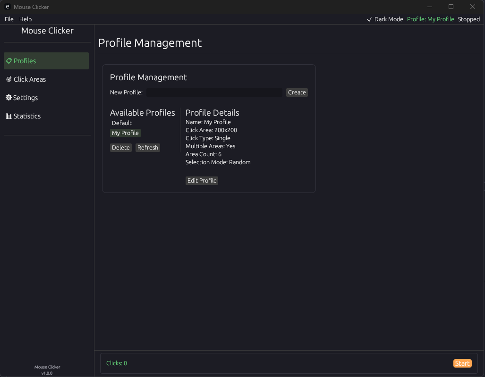

# Mouse Clicker

A modern, feature-rich mouse automation tool built with Rust and egui.



## Features

- **Profile Management**: Create and save different clicking profiles
- **Click Areas**: Define specific areas on the screen for clicking
- **Human-like Movement**: Simulate natural mouse movements and clicks
- **Customizable Settings**: Adjust click intervals, randomization, and more
- **Modern UI**: Clean, intuitive interface with dark mode support

## Installation

### Pre-built Binaries

Download the latest release for your platform from the [Releases](https://github.com/x0BiNbo/Mouse-Clicker/releases) page.

### Building from Source

1. Make sure you have Rust installed. If not, install it from [rustup.rs](https://rustup.rs/).
2. Clone this repository:
   ```
   git clone https://github.com/x0BiNbo/Mouse-Clicker.git
   cd Mouse-Clicker
   ```
3. Build the application:
   ```
   cargo build --release
   ```
4. The compiled binary will be in `target/release/mouse`.

## Usage

1. Launch the application
2. Create a new profile or select an existing one
3. Configure click areas and settings
4. Click the "Start" button to begin automation
5. Press the "Pause" or "Stop" button to control the automation

### Profiles

Profiles allow you to save different configurations for various use cases. Each profile includes:
- Click intervals
- Mouse movement settings
- Click areas
- Other customizations

### Click Areas

Define specific regions on your screen where clicks should occur:
1. Click "New Area" in the Click Areas tab
2. Select a region on your screen
3. Configure click settings for that area
4. Save the area to your profile

## Configuration

All settings are accessible through the UI. The application saves profiles in the `profiles` directory.

## License

This project is licensed under the MIT License - see the [LICENSE](LICENSE) file for details.

## Acknowledgments

- Built with [egui](https://github.com/emilk/egui) for the UI
- Uses [enigo](https://github.com/enigo-rs/enigo) for cross-platform mouse control
